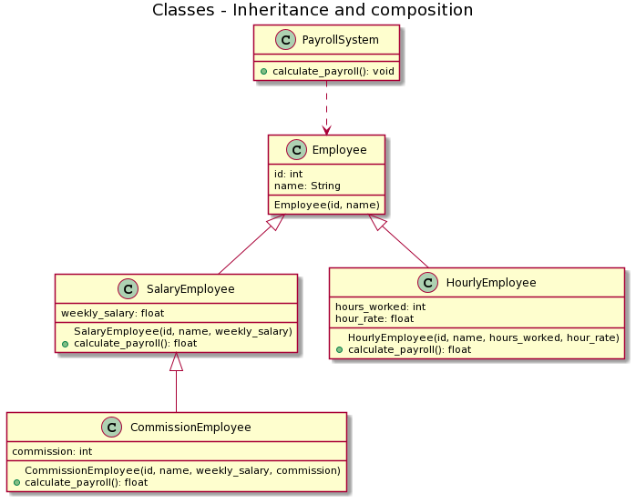
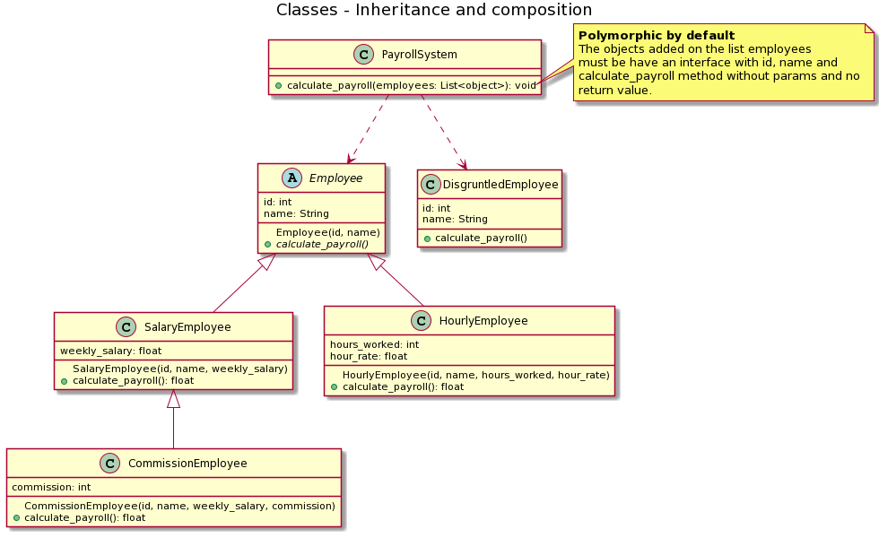
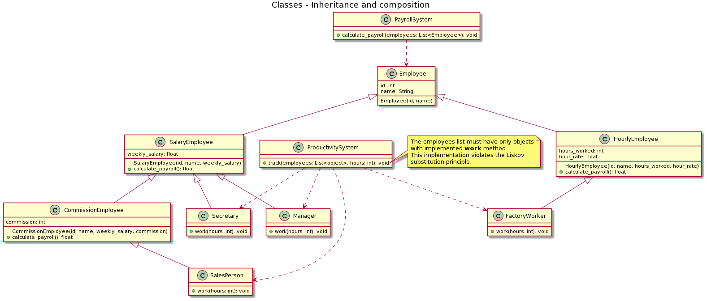
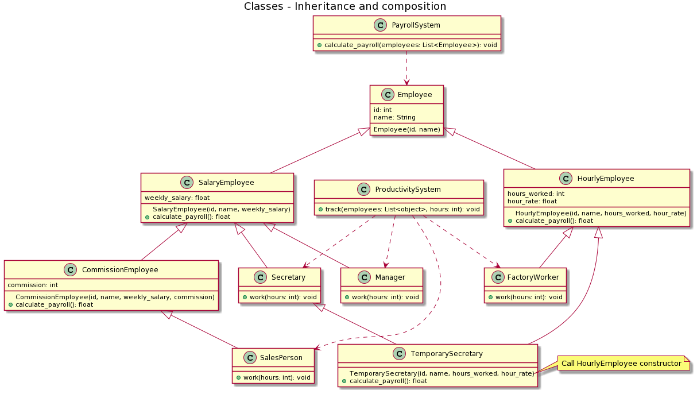
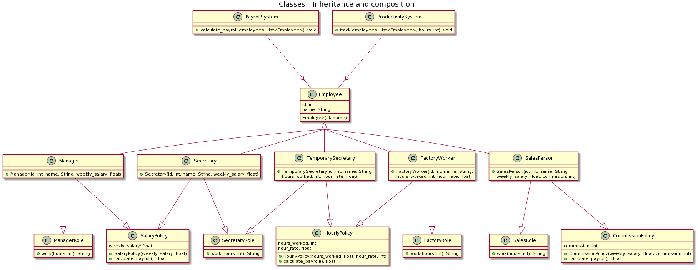
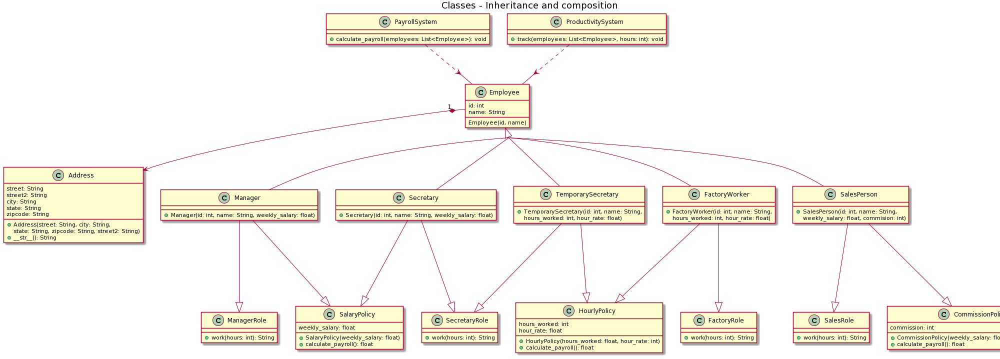
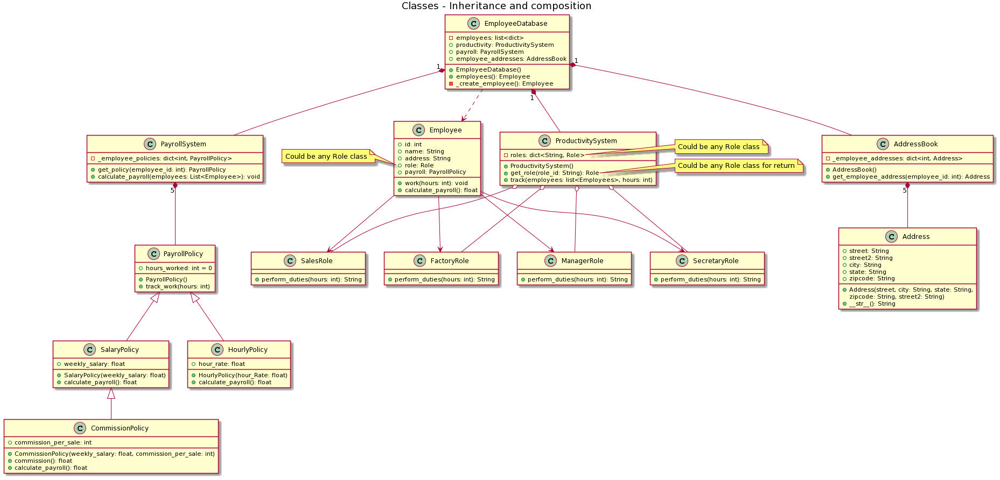
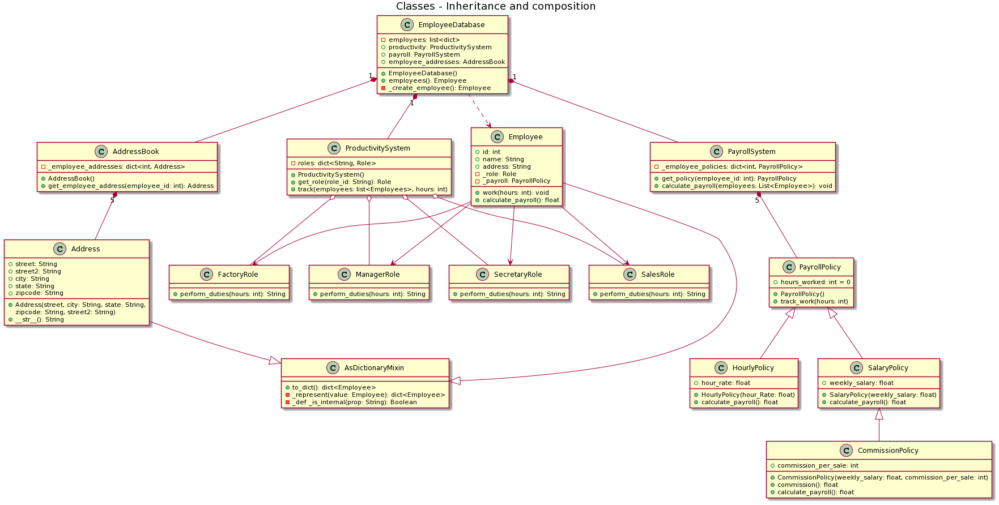

# Inheritance and composition in Python
This is a serie of versions about the HR system example, implemented in the Inheritance and composition article on [Real Python](https://realpython.com/inheritance-composition-python/#what-are-inheritance-and-composition).

I suppose that the example would be more easy to understand if you are the option to see the evolution with versions control.

Each version of the example will be published by branches.

## v1
The HR system needs to process payroll for the company’s employees, but there are different types of employees depending on how their payroll is calculated:

## v2
The HR system ensures that the Employee class cannot be instantiated, making it abstract. The exposed method of the PayrollSystem class is now polyphomic by default. Therefore, the DisgruntledEmployee class is created, to show that inheriting from Employee is not required, to use the interface of the PayrollSystem class:

## v3
When the HR system requires new functionality, inheritance can become difficult to understand and maintain. This is known as the class explosion problem. In this example, the HR system is expanded, adding a new function that shows productivity by roles in the company:

## v4
Multiple inheritance with diamond problem that you should to avoid.

## v5
Solving the diamond problem with the division of responsibilities.

## v6
First example of composition: Now Employee **has a** Address contact.

## v7
Using the composition to implement a better design that still fits the requirements of the PayrollSystem and the ProductivitySystem.

## v8
Added a mixin class. A mixin is a class that provides methods to other classes but are not considered a base class.

## v9
Added some design patterns like Singleton and Factory method for still the relationship between Employee and those objects is loosely coupled.