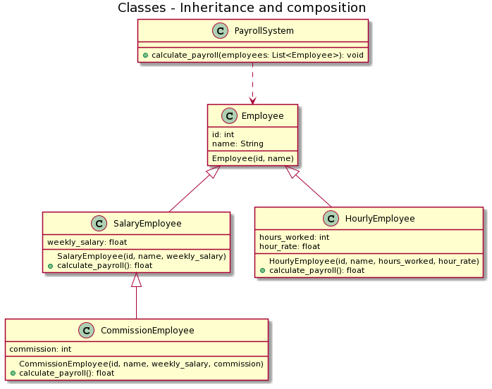

# Inheritance and composition in Python
This is a serie of versions about the HR system example, implemented in the Inheritance and composition article on [Real Python](https://realpython.com/inheritance-composition-python/#what-are-inheritance-and-composition).

I suppose that the example would be more easy to understand if you are the option to see the evolution with versions control.

Each version of the example will be published by branches.

## v1
The HR system needs to process payroll for the company’s employees, but there are different types of employees depending on how their payroll is calculated:

